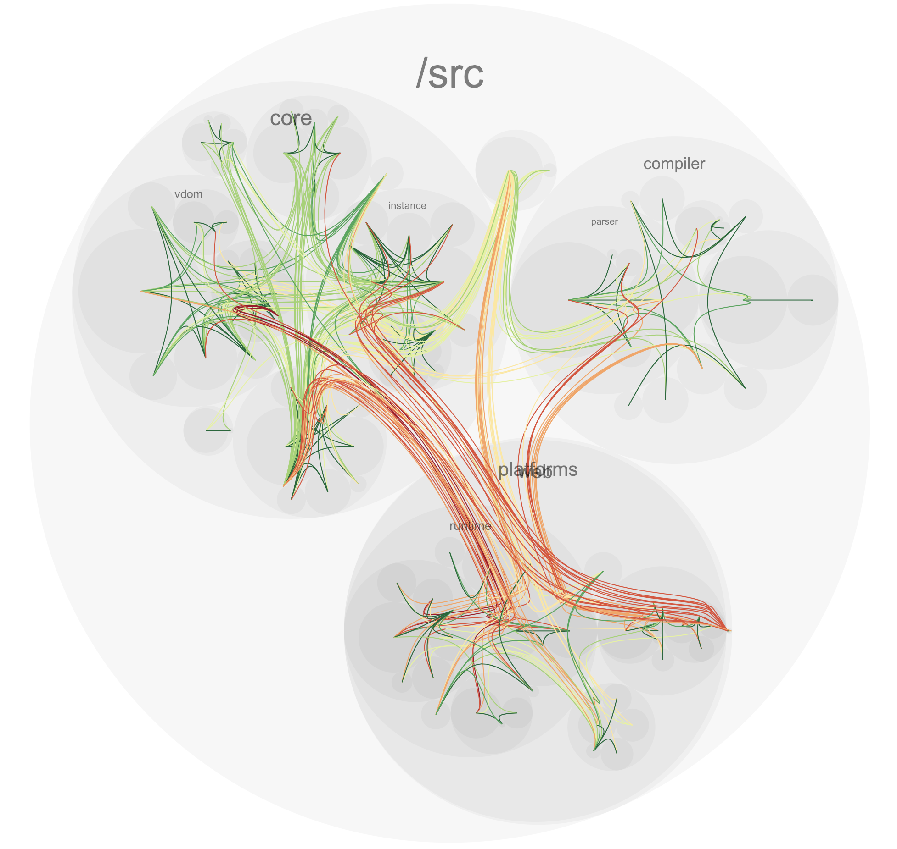

# rollup-plugin-deps

This is a rollup plugin that can help you visualize the dependencies between files.


## Examples

**VueJS**



## Install

```sh
npm install rollup-plugin-dependency-flow
```

## Usage

```js
const deps = require('rollup-plugin-dependency-flow');

// rollup config
module.exports = {
  plugins: [
    deps()
  ]
};
```

The web server usually runs on `localhost:3001?ws=localhost:5051` if the ports are available, check the console output for `Running dependency flow at: <adress>` to see where the server is running.
